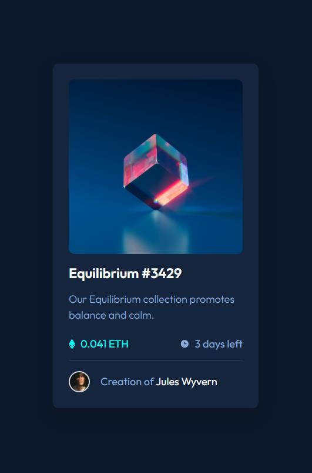

# Frontend Mentor - NFT preview card component solution

This is a solution to the [NFT preview card component challenge on Frontend Mentor](https://www.frontendmentor.io/challenges/nft-preview-card-component-SbdUL_w0U). Frontend Mentor challenges help you improve your coding skills by building realistic projects.

## Table of contents

- [Overview](#overview)
  - [The challenge](#the-challenge)
  - [Screenshot](#screenshot)
  - [Links](#links)
- [My process](#my-process)
  - [Built with](#built-with)
  - [What I learned](#what-i-learned)
  - [Continued development](#continued-development)

## Overview

### The challenge

Users should be able to:

- View the optimal layout depending on their device's screen size
- See hover states for interactive elements

### Screenshot



### Links

- Solution URL: [Frontend Mentor Solution Page](https://www.frontendmentor.io/solutions/nft-preview-card-with-flexbox-and-css-grid-X2m-oXym3)
- Live Site URL: [Live DEMO](https://pompoko-lab.github.io/NFT-preview-card/)

## My process

### Built with

- Semantic HTML5 markup
- CSS custom properties
- Flexbox
- CSS Grid

### What I learned

- Implementing a footer with the use of flexbox.

```css
body {
  display: flex;
  flex-direction: column;
}

main {
  display: flex;
  justify-content: center;
  align-items: center;
  min-height: 100vh;
}
```

- Resizing in CSS grid.

```css
.card {
  width: 350px;
  display: grid;
  grid-template-columns: repeat(2, 1fr);
  grid-template-areas:
    "image image"
    "header header"
    "p p"
    "eth-num days-left"
    "footer footer";
}

.card > img {
  width: 100%;
  height: auto;
  /* grid-column: 1 / -1; */
  grid-area: image;
}
```

- More about CSS selector specificity

- Adding a color over the image was my biggest hurdle for this challenge. I ended up creating a div which allowed me to set as a relative position (I couldn't apply it to the image).

```css
.overlay:hover::after {
  content: "";
  position: absolute;
  width: 100%;
  height: 100%;
  top: -0.2em;
  left: 0;
  background-color: hsla(178, 100%, 50%, 0.6);
  border-radius: 0.5em;
  cursor: pointer;
  background-image: url("images/icon-view.svg");
  background-repeat: no-repeat;
  background-position: center;
}
```

### Continued development

One of my weaker areas is working with the pseudo-classes ::after and ::before. This allowed me to strengthen this and I hope to overcome this weakness soon.
